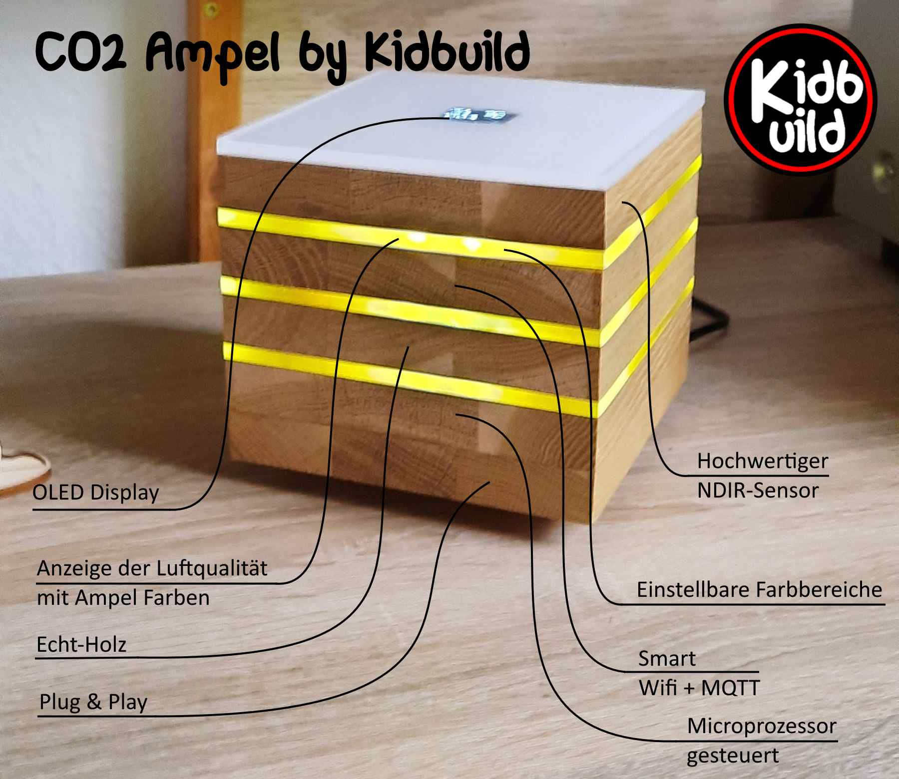
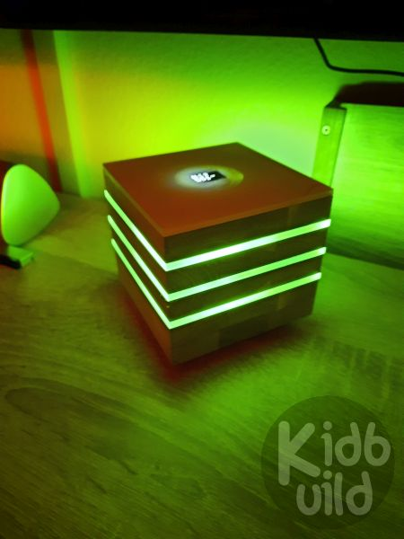
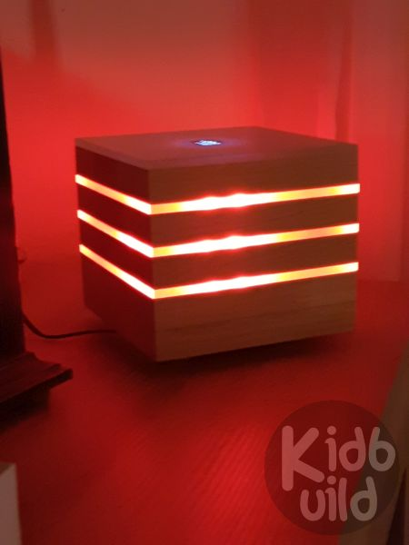
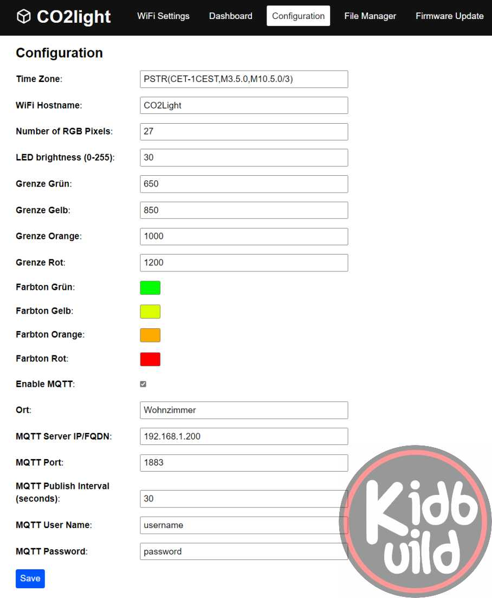
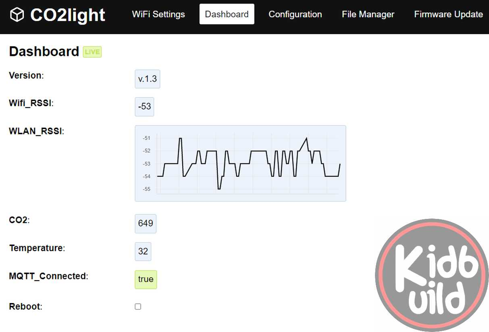
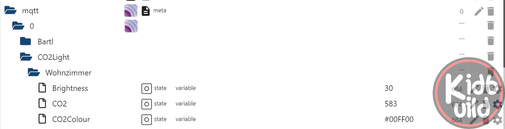

# CO2light by Kidbuild

## Description
This project shows you the air quality of your enviroment. I use MH-Z19B sensor to get the enviroment air quality.
To get a quick view of the CO2 value, there is a WS2812B stripe who will show the quality in four steps. The SSD1306 display 
will give you more informations about the web page and the messured values. You can change the ranges of colors against the CO2 value. 

## Features
- the code creates a filesystem on flash storage of the esp8266
- all settings are stored on the filesystem in a JSON format
- Wifi-Manager for easy connection to available AccessPoints
- MQTT client to transmit the values to a central server like home-automation-systems
- Brightness configurable via MQTT subscription (e.g. for automated day/night mode)
- Publishing the color of CO2 value via MQTT in HTML code (e.g. to display in homeautiomation)
- Publishing the CO2 value via MQTT
- Publishing the temperature, pressure, humidity values via MQTT
- Webpage to configure all settings or read the values
- OTA Over-The-Air update of firmware
- Online update via internet
- Color picker for all color states
- Color ranges configurable
- Manual calibration of CO2 value possible via dashboard
- Additional sensors like BMP280, BME280, SHT3x
- Multi language support (define the language file in main.cpp and upload the xx.json file of depending language in "File Manager")

## Schematic

| NodeMCU Board Pins |     | Device Pin         | Device Name  |   
|--------------------|-----|--------------------|--------------|   
| GND                | GND | GND                | SSD1309 OLED |   
| 3.3V               | 3V3 | Vin                | SSD1309 OLED |   
| GPIO5              | D1  | SCL                | SSD1309 OLED |   
| GPIO4              | D2  | SDA                | SSD1309 OLED |
| GND                | GND | GND                | I2C Sensor   |   
| 3.3V               | 3V3 | Vin                | I2C Sensor   |   
| GPIO5              | D1  | SCL                | I2C Sensor   |   
| GPIO4              | D2  | SDA                | I2C Sensor   |   
| GPIO3              | RX  | Data in            | WS2812B LED  |   
| Vin or 5V          | Vin | +5V                | WS2812B LED  |
| GND                | GND | GND                | WS2812B LED  |
| GPIO13             | D7  | UART TXT (gn)      | MH-Z19 CO2   |
| GPIO15             | D8  | UART RXT (bl)      | MH-Z19 CO2   |
| GND                | GND | GND (sw)           | MH-Z19 CO2   |
| Vin or 5V          | Vin | +5V (rt)           | MH-Z19 CO2   |
| A0                 | A0  | A0                 | MQ-Sensor    |
| Vin or 5V          | Vin | Vcc                | MQ-Sensor    |
| GND                | GND | GND                | MQ-Sensor    |
| GND                | GND | GND                | PIEZO        |
| GPIO0              | D3  | +                  | PIEZO        |

## Supported Sensors

| Sensor Type   | Functions                         |
|---------------|-----------------------------------|
| BMP280        | Temperature, Pressure             |
| BME280        | Temperature, Pressure, Humidity   |
| SHT3x         | Temperature, Humidity             |

## Steps to get running
1. Install VS-Code
2. https://github.com/maakbaas/esp8266-iot-framework/blob/master/docs/getting-started.md
3. Install required libraries: PubSubClient, Adafruit_GFX, Adafruit_SSD1306; Adafruit_NeoPixel; MHZ19 ... 
4. Compile
If you get errors you can try:
5. npm ci fix: npm ci --legacy-peer-deps

## Weblinks to get running
- http://www.kidbuild.de or https://shop.kidbuild.de
E-Mail info@kidbuild.de

## Changelog 

### Version 2.9
- Added language support for display
- Added selection of displays in config menu

### Version 2.8
- Added SHT3x sensor issue #4
- Added separators in config and dashboard
- switch BUILTIN_LED OFF 

### Version 2.71
- Added BME280 sensor publishing values via MQTT

### Version 2.7
- Added BME280 sensor support
- Added piezo tone frequency configurable via slider
- Removed while in setup routine (deadlock)

### Version 2.6
- Added showing humidity on display

### Version 2.5
- Added function for 3 segmentation of LED stripe (CO2, Temperature, MQ-Sensor)
- Added settings for temperature boarders & colors
- Added settings for MQ sensor boarders & colors
- Added support of I2C sensor SHT31-D
- Added humidity to MQTT publish

### Version 2.4
- Changed display to rolling display mode
- Added online update via internet connection
- Added I2C scanner for address of I2C devices
- Added support of I2C sensor BMP280
- Added pressure + temperature to MQTT publish
- Added MQ-Sensor´s analog value to MQTT publish
- Added Piezo (one time one second sound at last boarder. Connected on pin D3 (GPIO0) )

### Version 2.3
- Changed MQTT client-id from random to MAC-Address. Issue #1
- Password hidden now. Issue #3

### Version 2.2
- Bugfixes
- Changed Adafruit Neopixel lib to NeoPixelBus regarding disabled interrupts. This will break Wifi (You have to change the Din Pin to GPIO3 for dma)

### Version 2.1
- Bugfix MQTT client.loop

### Version 2.0   
- Added manual calibration via dashboard (takes 20 minutes on fresh air)
- Changed structure of code
- Moved default boarders of CO2 colors
- Updated framework
- Changed brightness to slider

### Version 1.3   
(Eisbaeeer 20211209)
- Added color picker for each color
- Added MQTT enable / disable button
- Brightness adjustable via MQTT subscription "Brightness"
- Publishing LED colour as HTML 
- LED pixels count configurable

### Version 1.0
(Eisbaeeer 20211126)
- Migrated project to iot framework   
- MQTT settings configurabel, now
- Color ranges configurable, now
- Wifi hostname configurable, now
- Wifi RSSI visible on dashboard

### Verison 0.4
(Eisbaeeer 20201222)   
- Only send MQTT if request of CO2 is valid

### Version 0.3
(Eisbaeeer 20201220)   
- Added temperature, humidity and ppm on webpage

### Version 0.2 
(Eisbaeeer 20201220)   
- added WifiManager
- added Website for config brightness
- added HttpUpdateServer
- added MQTT

### Version 0.1 
(Eisbaeeer 20201216)   
- initial version

Used Licenses in this project:

| URL                                                   | License                                   |
|-------------------------------------------------------|-------------------------------------------|
| https://github.com/lorol/ESPAsyncWebServer            | unknown                                   |
| https://github.com/WifWaf/MH-Z19                      | GNU Lesser General Public License v3.0    |
| https://github.com/maakbaas/esp8266-iot-framework     | GNU General Public License v3.0           |
| https://github.com/Makuna/NeoPixelBus                 | GNU Lesser General Public License v3.0    |
| https://github.com/adafruit/Adafruit_SSD1306          | Software License Agreement (BSD License)  |
| https://github.com/adafruit/Adafruit_BMP280_Library   | unknown                                   |
| https://github.com/adafruit/Adafruit_BME280_Library   | All rights reserved by Adafruit.          |
| https://github.com/adafruit/Adafruit_SHT31            | All rights reserved by Adafruit.          |
| https://github.com/PaulStoffregen/Time                | unknown                                   |
| https://github.com/adafruit/Adafruit_BusIO            | MIT License                               |
| https://github.com/knolleary/pubsubclient/            | MIT License                               |