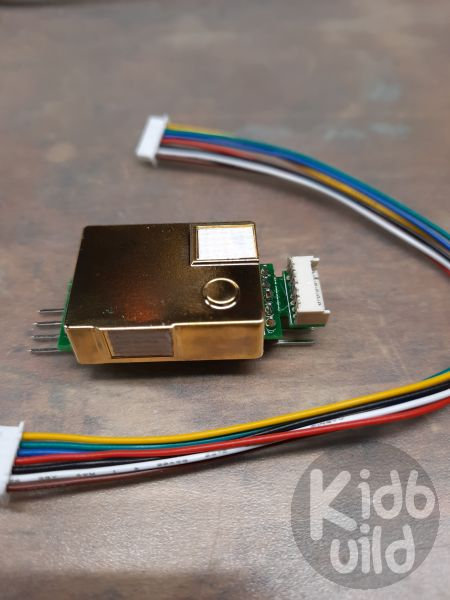

# CO2light by Kidbuild

## Description
This project shows you the air quality of your enviroment. I use MH-Z19B and DHT-22 sensors to get the enviroment air quality.
To get a quick view of the CO2 value, there is a WS2812B stripe who will show the quality in four steps. The SSD1306 display 
will give you more informations about the web page and the messured values. 

## Features
- the code creates a filesystem on flash storage of the esp8266
- all settings are stored on the filesystem in a JSON format
- Wifi-Manager for easy connection to available AccessPoints
- MQTT client to transmit the values to a central server like home-automation-systems
- Webpage to configure all settings or read the values
- OTA Over-The-Air update of firmware

## Steps to get running
1. Install Arduino IDE
2. Define board URL: http://arduino.esp8266.com/stable/package_esp8266com_index.json
3. Install board ESP8266
4. Install required libraries: ArduinoJson-5, PubSubClient, WiFiManager, Adafruit_GFX, Adafruit_SSD1306; Adafruit_Sensor; Adafruit_NeoPixel; DHT; MHZ19 ... 
5. Open the source
6. Compile with your board settings

## Weblinks to get running
- http://www.kidbuild.de or https://shop.kidbuild.de
E-Mail info@kidbuild.de

## ToDo
- MQTT settings via Web-Page
- Define coulours via Web-Page

## Changelog 

### Verison 0.4
(Eisbaeeer 20201222)   
- Only send MQTT if request of CO2 is valid

### Version 0.3
(Eisbaeeer 20201220)   
- Added temperature, humidity and ppm on webpage

### Version 0.2 
(Eisbaeeer 20201220)   
- added WifiManager
- added Website for config brightness
- added HttpUpdateServer
- added MQTT

### Version 0.1 
(Eisbaeeer 20201216)   
- initial version
